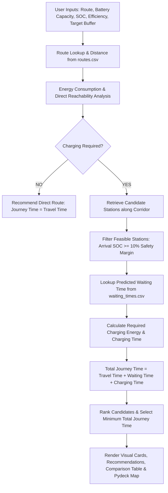

# Optimal EV Transportation Planning ⚡

> **Phase 1 College BTP Prototype**  
> Smart route and charging planning for Electric Vehicles with waiting-time optimization.

---

## 📌 Project Overview

This prototype demonstrates a complete, end-to-end charging-planning workflow for an EV driver. Given a travel origin, destination, vehicle car model (which automatically populates battery capacity & efficiency), departure SOC, and target reserve buffer in kilometers, the system:

1. **Loads Corridor & Vehicle Data**: Dynamically queries route distance, base travel time, candidate charging stations, and auto-populates EV battery capacity & efficiency from popular vehicle profiles.
2. **Evaluates Direct Energy Balance**: Determines if the EV can reach the destination directly while maintaining the desired reserve buffer in kilometers, or if an intermediate charging stop is required.
3. **Screens Station Feasibility**: Evaluates candidate stations along the corridor ensuring the battery does not breach a $10\%$ safety threshold before arrival.
4. **Integrates Waiting Times**: Pulls predicted queue and waiting times from mock ML outputs (`waiting_times.csv`).
5. **Calculates Required Charging Energy & Duration**: Determines exact energy needed to reach the destination and the resulting charging time on the station's DC fast charger.
6. **Optimizes Total Journey Time**:
   $$\text{Total Journey Time} = \text{Travel Time} + \text{Waiting Time} + \text{Charging Time}$$
7. **Recommends Optimal Station**: Selects and highlights the candidate station that minimizes overall trip duration.

---

## 🏗️ Project Architecture

The codebase is organized into modular components to make it easy for team members to plug in their respective modules (e.g., live ML model, real-time routing APIs, grid-aware schedulers):

```text
.
├── app.py                      # Main Streamlit web application entrypoint
├── data/
│   ├── routes.csv              # Corridors, distances, coordinates, travel times
│   ├── charging_stations.csv   # Station specs, power (kW), slots, locations
│   └── waiting_times.csv       # ML mock predicted waiting times & queue lengths
├── src/
│   ├── __init__.py
│   ├── data_loader.py          # Dynamic CSV data access & caching
│   ├── route_logic.py          # Route parsing, detour travel time & corridor coords
│   ├── energy_logic.py         # EV energy consumption & direct feasibility analysis
│   ├── station_logic.py        # Candidate station screening & safety SOC checks
│   ├── charging_logic.py       # Charging energy, time calculation & ranking
│   └── ui.py                   # Modern EV design system, cards, charts & map
├── tests/
│   └── test_pipeline.py        # Automated unit and integration tests
├── requirements.txt            # Python dependencies
└── README.md                   # Project documentation
```

---

## 🔄 End-to-End Pipeline



---

## 🔢 Core Mathematical Formulations

1. **Direct Energy Required**:
   $$E_{\text{trip}} = \frac{D_{\text{route}}}{\eta_{\text{EV}}}$$
   where $D_{\text{route}}$ is route distance (km) and $\eta_{\text{EV}}$ is EV efficiency (km/kWh).

2. **Energy Balance & Charging Decision**:
   $$E_{\text{dest}} = E_{\text{initial}} - E_{\text{trip}}$$
   - If $E_{\text{dest}} \ge E_{\text{target\_buffer}}$, **Charging Required = NO**.
   - If $E_{\text{dest}} < E_{\text{target\_buffer}}$, **Charging Required = YES**.

3. **Station Feasibility**:
   $$E_{\text{arrival}} = E_{\text{initial}} - \frac{D_{\text{along}} + D_{\text{detour}}}{\eta_{\text{EV}}}$$
   $$\text{Feasible if: } E_{\text{arrival}} \ge B_{\text{capacity}} \times 0.10$$

4. **Required Charging Energy**:
   $$E_{\text{charge\_needed}} = \max\left(0, \frac{D_{\text{remaining}} + D_{\text{detour}}}{\eta_{\text{EV}}} + E_{\text{target\_buffer}} - E_{\text{arrival}}\right)$$

5. **Charging Duration**:
   $$T_{\text{charge}} = \left(\frac{E_{\text{charge\_needed}}}{P_{\text{charger}}}\right) \times 60 \quad (\text{minutes})$$

6. **Total Journey Time Optimization**:
   $$T_{\text{total}}(s) = T_{\text{travel}}(s) + T_{\text{wait}}(s) + T_{\text{charge}}(s)$$
   $$s^* = \arg\min_{s \in \mathcal{S}_{\text{feasible}}} T_{\text{total}}(s)$$

---

## 🚀 How to Run the Application

### 1. Prerequisites
- Python 3.9+ installed.

### 2. Setup Virtual Environment & Install Dependencies

```bash
# Navigate to project directory
cd /path/to/BTP

# Create virtual environment
python3 -m venv .venv

# Activate virtual environment
# On macOS / Linux:
source .venv/bin/activate
# On Windows:
# .venv\Scripts\activate

# Install dependencies
pip install -r requirements.txt
```

### 3. Run Automated Integration Tests

```bash
python tests/test_pipeline.py
```

### 4. Launch the Streamlit Web Application

```bash
streamlit run app.py
```

Open your browser at **`http://localhost:8501`**.

---

## 👥 Team Module Integration Guide

- **Person 1 (ML Waiting Time Model)**: Replace the CSV lookup in [`src/data_loader.py`](file:///Users/harsh/Documents/BTP/src/data_loader.py) `get_waiting_time_info()` with your trained ML inference model / pickle pipeline.
- **Person 2 (Routing Engine)**: Replace the distance / duration lookups in [`src/route_logic.py`](file:///Users/harsh/Documents/BTP/src/route_logic.py) with dynamic OSRM / Google Directions API calls.
- **Person 3 (Grid & Dynamic Pricing)**: Extend [`src/charging_logic.py`](file:///Users/harsh/Documents/BTP/src/charging_logic.py) to incorporate tariff weights into the objective cost function.


